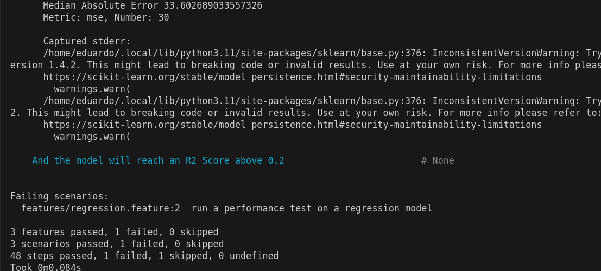

# BDD4ML : Um framework para avaliar modelos de machine learning 

## Breve Descrição
O projeto proposto se chama BDD4ML. Se trata de um framework de testes de modelos de machine learning usando cláusulas de Behaviour Driven Development (BDD). Utilizando o framework "Behave", o sistema associará funções de código a descrições em linguagem natural do comportamento do sistema. Essa associação sinaliza aos usuários finais como o sistema realmente se comporta, sem exigir conhecimento de programação. Essa feature torna essa ferramenta interessante para ser usada tanto por desenvolvedores de sistemas com componentes de machine learning como por usuários finais pouco versados em programação de casos de testes.


## Visão de Projeto

### Cenário Positivo 1

Marcos deseja testar se o modelo de machine learning está performando conforme o esperado. Para realizar isso decide utilizar do Framework BDD4ML para averiguar as métricas de seu modelo de classificação. Ao instalar o framework ele define o arquivo com o modelo de classificação que deseja testar e define também o arquivo com casos de testes que ele deseja usar. Após definir os arquivos necessários Marcos decide criar os arquivos de teste do framework seguindo as diretrizes especificadas na documentação. Finalmente, Marcos executa os testes e obtém o relatório final dos resultados.

### Cenário Positivo 2

Marcos deseja testar se o modelo de machine learning está performando conforme o esperado. Para realizar isso decide utilizar do Framework BDD4ML para averiguar as métricas de seu modelo de regressão. Ao instalar o framework ele define o arquivo com o modelo de classificação que deseja testar e define também o arquivo com casos de testes que ele deseja usar. Após definir os arquivos necessários, Marcos decide criar os arquivos de teste do framework seguindo as diretrizes especificadas na documentação. Finalmente, Marcos executa os testes e obtém o relatório final dos resultados.


### Cenário Negativo 1

Marcos deseja testar se um modelo de machine learning de clusterização está performando conforme o esperado. Para realizar isso decide utilizar do Framework BDD4ML para averiguar as métricas de seu modelo de clusterização. Ao instalar o framework ele define o arquivo a ser testado como um modelo de clusterização. Após definir o arquivo com casos de testes ele deseja usar e criar os arquivos do framework seguindo as diretrizes especificadas na documentação. Finalmente Marcos executa os testes e obtém um erro indicando que o framework não conseguiu identificar o tipo de modelo usado. Após ler melhor a documentação Marcos percebe que modelos de clusterização não são suportados pelo framework e decide procurar outra ferramenta para lhe ajudar.

### Cenário Negativo 2

Marcos deseja testar se um modelo de machine learning de classificação associado ao seu programa está performando conforme o esperado. Para realizar isso decide utilizar do Framework BDD4ML para averiguar as métricas de seu modelo de clusterização. Ao instalar o framework ele define o arquivo a ser testado como um modelo de clusterização. Após definir o arquivo com casos de testes ele deseja usar e criar os arquivos do framework seguindo as diretrizes especificadas na documentação. Finalmente Marcos executa os testes e obtém um erro indicando que os arquivos de modelo e de casos de teste fornecidos são incompatíveis. Marcos então decide averiguar a origem dos arquivos para entender a fonte da incompatibilidade.

### Cenário Negativo 3

Marcos deseja testar se um modelo de machine learning de classificação associado ao seu programa está performando conforme o esperado. Para realizar isso decide utilizar do Framework BDD4ML para averiguar as métricas de seu modelo de clusterização. Ao instalar o framework ele define o arquivo a ser testado como um modelo de clusterização. Após definir o arquivo com casos de testes ele deseja usar e criar os arquivos do framework seguindo as diretrizes especificadas na documentação. Finalmente Marcos executa os testes e obtém um erro indicando que o framework não conseguiu identificar o tipo de métrica informada nos arquivos do framework. Após ler melhor a documentação Marcos percebe que a métrica que informou não é suportada pelo framework e decide procurar outra ferramenta para lhe ajudar.

## Documentação Técnica do Projeto

### Diagrama de Classes

Abaixo se encontra um diagrama de classes completo do sistema. Em resumo, cada componente é utilizado na composição de uma entidade centralizadora 'Controller' que executa toda a rotina de testes do software. Esse 'Controller' é utilizado pela variável de 'Context' da biblioteca Behave além de duas classes para validar o modelo sendo utilizado nos testes.


### Requisitos Funcionais

#### Introudção

Essa seção tem como objetivo elucidar todas as funcionalidades do framework. Cada funcionalidade do framework está associada a uma cláusula BDD do framework. Após a descrição de cada funcionalidade há uma seção explicando como construir a cláusula daquela funcionalidade.

Há 3 tipos de cláusula BDD, elas se diferenciam pelo seu inicio: "Given", "When" ou "Then". Entretanto, quando uma cláusula repete o inicio da anterior o seu inicio deve ser substituído por "AND".

exemplo

```gherkin
Given We obtain a regression model from the file earthquakeKNNRegressor-orig.pkl
And We obtain test data from the file test_data_earthquake.csv
```

#### Leitura de arquivos de modelos: 
O framework pode ler arquivos de modelos para testes. Esses arquivos devem ser legíveis pela biblioteca "pickle". O framework deve ser capaz de rodar em modelos de classificação e regressão. O usuário deve fornecer a localização do arquivo do modelo como uma declaração BDD. Além disso o usuário deverá oferecer um arquivo de configuração json do modelo especificando quais os nomes de cada feature. separadas em features usadas para prever o valor e features a serem previstas (target).


```json
{
    "feature_names" : [...],  // lista de features usadas na predição de novos valores
    "feature_types" : [...],  // lista dos tipos usados em cada feature, deve alinhar com os valores em "feature_names" 
    "target_names" : [...],   // lista de features que o modelo realiza a predição
    "target_types" : [...]    // lista dos tipos usados em cada feature, deve alinhar com os valores em "target_names" 
}
```

__cláusula_BDD__

```gherkin
Given We obtain a {model_type} model from the file {model_filename}
```

`<model_type>` deve dizer qual o tipo do modelo, o framework somente suporta modelos de classificação e regressão feitos no formato pickle:

&nbsp;&nbsp;&nbsp;&nbsp;`classification` - indica que o modelo é de classificação.

&nbsp;&nbsp;&nbsp;&nbsp;`regression` - indica que o modelo é de regressão.


`<model_filename>` - Deve dizer qual o nome do arquivo do modelo, este arquivo deve estar na pasta 'estimators' na raiz do projeto.


#### Leitura de arquivos de teste: 
O framework deve ser capaz de ler arquivos que contêm todos os casos de teste a serem avaliados pelo modelo. Esses casos de teste devem ser compatíveis com o modelo fornecido para teste e devem estar no formato de um arquivo "Comma-separated values" (.csv). O usuário deve fornecer a localização do arquivo de teste como uma declaração BDD.

__cláusula_BDD__

```gherkin
Given We obtain test data from the file {filename}
```

`<filename>` deve dizer qual o nome do arquivo com os casos de teste, este arquivo deve estar na pasta 'test_data' na raiz do projeto, o arquivo deve ser escrito em .csv.


#### Executando o teste do modelo: 
Após fornecer tanto os arquivos do modelo quanto os arquivos de teste, o framework executa os testes e produz uma estrutura de dados contendo os resultados. Esses resultados podem ser utilizados em funcionalidades posteriores para avaliação. O framework deve ser capaz de rodar em modelos de classificação e regressão.

__cláusula_BDD__

```gherkin
When We process the data
```

#### Métricas de desempenho descritivo do modelo: 
Com os resultados dos testes de funcionalidades anteriores, o usuário deve fornecer ao sistema uma consulta sobre os resultados desse teste. Essa consulta deve ser feita na forma de uma declaração BDD que compare o resultado de uma métrica do modelo a um limite esperado pelo usuário. Essas consultas devem demonstrar os resultados das métricas do modelo de maneira descritiva para o usuário final, evitando confusão. A métrica utilizada não deve ser declarada explicitamente, mas sim explicada no contexto do resultado. Essa abordagem pode ser aplicada tanto para métricas de precisão quanto de recall, que serão detalhadas nos tópicos abaixo.


__Métrica descritiva de recall geral:__ Em vez de afirmar "o modelo atingiu 70 por cento de recall," a consulta deve dizer, "o modelo identifica 70 por cento dos casos corretos de todas as classes."


__cláusula_BDD__

```gherkin
Then the model identifies {number} percent of the correct cases of all classes (with a {average_type})*

# * o trecho é opcional, se assume por padrão o valor 'macro average' para 'average_type'
```

`<number>` - valor numérico entre 0 e 100 que indica o percentual que a métrica de recall deve atingir.


`<average_type>` -  deve dizer qual o tipo de média a ser usada no calculo da métrica. As opções são a seguir:

&nbsp;&nbsp;&nbsp;&nbsp;`macro average` - não leva em consideração a proporção que cada resultado da classificação tem nos resultados dos testes.

&nbsp;&nbsp;&nbsp;&nbsp;`weighted average` - leva em consideração a proporção que cada resultados da classificação tem nos resultados dos testes.

__Métrica descritiva de recall de uma classe específica:__ Em vez de afirmar "o modelo atingiu 70 por cento de recall em 'tem diabetes'," a consulta deve dizer, "o modelo identifica 70 por cento dos casos corretos de 'tem diabetes'.".

__cláusula_BDD__

```gherkin
Then the model identifies {number} percent of the correct cases of class '{class}'
```

`<number>` - valor numérico entre 0 e 100 que indica o percentual que a métrica de recall deve atingir.


`<class>` -  qual o resultado especifico de classificação que deseja medir o recall. Se o seu dataset tem como possíveis resultados de classificação 'setosa' ou 'virginica' alguma delas deverá ser o valor de 'class'.


__Métrica descritiva de precisão geral:__ Similar ao caso anterior, a precisão pode ser apresentada de forma descritiva. Em vez de afirmar "o modelo atingiu 80 por cento de precisão em todas as classes," a consulta deve dizer, "o modelo atribui a classificação de todas as classes corretamente 80 por cento do tempo."

__cláusula_BDD__

```gherkin
Then the model correctly classifies positives of all classes (with a {average_type})*  {number} percent of the time

# * o trecho é opcional, se assume por padrão o valor 'macro average' para 'average_type'
```

`<number>` - valor numérico entre 0 e 100 que indica o percentual que a métrica de precisão deve atingir.

`<average_type>` -  deve dizer qual o tipo de média a ser usada no calculo da métrica. As opções são a seguir:

&nbsp;&nbsp;&nbsp;&nbsp;`macro average` - não leva em consideração a proporção que cada resultado da classificação tem nos resultados dos testes.

&nbsp;&nbsp;&nbsp;&nbsp;`weighted average` - leva em consideração a proporção que cada resultados da classificação tem nos resultados dos testes.


__Métrica descritiva de precisão de uma classe específica:__ Em vez de afirmar "o modelo atingiu 80 por cento de precisão em 'tem diabetes'," a consulta deve dizer, "o modelo atribui a classificação da classe 'tem diabetes' corretamente 80 por cento do tempo."

__cláusula_BDD__

```gherkin
Then the model correctly classifies positives of class '{class}' {number} percent of the time
```

`<number>` - valor numérico entre 0 e 100 que indica o percentual que a métrica de precisão deve atingir.


`<class>` -  qual o resultado especifico de classificação que deseja medir o recall. Se o seu dataset tem como possíveis resultados de classificação 'setosa' ou 'virginica' alguma delas deverá ser o valor de 'class'.

__Métrica descritiva de acurácia geral:__ Similar ao caso anterior, a precisão pode ser apresentada de forma descritiva. Em vez de afirmar "o modelo atingiu 80 por cento de acurácia em todas as classes," a consulta deve dizer, "o modelo atribui a classificação de todas as classes 80 por cento do tempo."

__cláusula_BDD__

```gherkin
Then the model correctly classifies of all classes with a {average_type} {number} percent of the time
```

`<number>` - valor numérico entre 0 e 100 que indica o percentual que a métrica de acurácia deve atingir.

`<average_type>` -  deve dizer qual o tipo de média a ser usada no calculo da métrica. As opções são a seguir:

&nbsp;&nbsp;&nbsp;&nbsp;`macro average` - não leva em consideração a proporção que cada resultado da classificação tem nos resultados dos testes.

&nbsp;&nbsp;&nbsp;&nbsp;`weighted average` - leva em consideração a proporção que cada resultados da classificação tem nos resultados dos testes.


__Métrica descritiva de acurácia de uma classe específica:__ Em vez de afirmar "o modelo atingiu 80 por cento de acurácia em 'tem diabetes'," a consulta deve dizer, "o modelo atribui a classificação da classe 'tem diabetes' corretamente 80 por cento do tempo."

__cláusula_BDD__

```gherkin
Then the model classifies the class '{class}' correctly {number} percent of the time
```

`<number>` - valor numérico entre 0 e 100 que indica o percentual que a métrica de acurácia deve atingir.


`<class>` -  qual o resultado especifico de classificação que deseja medir o recall. Se o seu dataset tem como possíveis resultados de classificação 'setosa' ou 'virginica' alguma delas deverá ser o valor de 'class'.


#### Métricas explícitas de desempenho de modelos de classificação:
Com os resultados dos testes de funcionalidades anteriores, o usuário deve fornecer ao sistema uma consulta sobre os resultados desse teste. Essa consulta deve ser feita na forma de uma declaração BDD que compare o resultado de uma métrica do modelo a um limite esperado pelo usuário. Diferente das métricas mencionadas em funcionalidades anteriores, muitas métricas, como o f1-score, não podem ser diretamente traduzidas de forma concisa para o usuário final e, portanto, só podem ser inferidas diretamente pelo framework. Uma consulta como "o modelo atingiu 0,8 de f1-score" não explica o que é a métrica, mas permite que todas as métricas sejam exibidas, independentemente de sua complexidade. Esta é a forma padrão de mostrar a maioria das métricas de classificação e regressão e estará disponível para todas as métricas cobertas pelo framework.

__Métrica explicita geral:__

__cláusula_BDD__

```gherkin
Then the model will reach {threshold} percent {metric} (on a {average_type})*

# * o trecho é opcional, se assume por padrão o valor 'macro average' para 'average_type'
```

`<threshold>` - valor numérico que indica o valor que a métrica deve atingir, para cada métrica abaixo está descrito o valor aceitado para ela.

`<metric>` - métrica deseja que o usuário deseja medir.

&nbsp;&nbsp;&nbsp;&nbsp;`recall` - aceita valores entre 0 e 100 (percentuais).

&nbsp;&nbsp;&nbsp;&nbsp;`precision` - aceita valores entre 0 e 100 (percentuais).

&nbsp;&nbsp;&nbsp;&nbsp;`accuracy` - aceita valores entre 0 e 100 (percentuais).

&nbsp;&nbsp;&nbsp;&nbsp;`f1_score` - aceita valores entre 0 e 100 (percentuais).

`<average_type>` -  deve dizer qual o tipo de média a ser usada no calculo da métrica. As opções são a seguir:

&nbsp;&nbsp;&nbsp;&nbsp;`macro average` - não leva em consideração a proporção que cada resultado da classificação tem nos resultados dos testes.

&nbsp;&nbsp;&nbsp;&nbsp;`weighted average` - leva em consideração a proporção que cada resultados da classificação tem nos resultados dos testes.

__Métrica explicita de uma classe específica:__

__cláusula_BDD__


```gherkin
Then the model will reach {threshold} percent {metric} on class '{class}'
```

`<threshold>` - valor numérico que indica o valor que a métrica deve atingir.

`<metric>` - métrica que o usuário deseja medir.

&nbsp;&nbsp;&nbsp;&nbsp;`recall`

&nbsp;&nbsp;&nbsp;&nbsp;`precision`

&nbsp;&nbsp;&nbsp;&nbsp;`accuracy`

&nbsp;&nbsp;&nbsp;&nbsp;`f1_score`

`<class>` -  qual o resultado especifico de classificação que deseja medir o recall. Se o seu dataset tem como possíveis resultados de classificação 'setosa' ou 'virginica' alguma delas deverá ser o valor de 'class'.


#### Métricas explícitas de desempenho de modelos de regressão:
A mesma ideia que a definição acima mas para modelos de regressão.

__cláusula_BDD__

```gherkin
Then the model will reach {metric} above {number}
```

`<number>` - valor numérico que indica o percentual que a métrica deve atingir.

`<metric>` - métrica que o usuário deseja medir.

&nbsp;&nbsp;&nbsp;&nbsp;`an R2 Score`

&nbsp;&nbsp;&nbsp;&nbsp;`a Mean Squared Error`

&nbsp;&nbsp;&nbsp;&nbsp;`a Mean Absolute Error`

&nbsp;&nbsp;&nbsp;&nbsp;`a Root Mean Squared Error`

&nbsp;&nbsp;&nbsp;&nbsp;`a Median Absolute Error`

### Requisitos Não-Funcionais

__Eficiência de Desempenho:__ O framework deve garantir a execução rápida dos testes para manter um ciclo de desenvolvimento eficiente, sem causar atrasos. Ele deve usar os recursos do sistema, como CPU e memória, de forma otimizada, o que é particularmente vital ao gerenciar grandes conjuntos de dados ou modelos complexos de aprendizado de máquina. A satisfação desse requisito dependerá de fatores como a escala do modelo e o tamanho dos dados de teste utilizados, o que pode ser alcançado implementando este framework em um ambiente adequado para escalabilidade.

__Escalabilidade:__ A escalabilidade é crucial para este framework. Ele deve lidar de maneira eficiente com um volume crescente de casos de teste e conjuntos de dados. A capacidade de escalar tanto horizontalmente (adicionando mais máquinas) quanto verticalmente (aumentando a potência da configuração existente) com base nas necessidades computacionais dos modelos de aprendizado de máquina em teste é essencial.


__Confiabilidade:__ O framework deve ser robusto o suficiente para gerenciar comportamentos inesperados ou falhas dos modelos de aprendizado de máquina durante os testes. Ele deve incluir mecanismos de tolerância a falhas e garantir que existam processos eficientes de recuperação para manter o estado do teste e a integridade dos dados após uma falha.

__Usabilidade:__ O framework deve ser amigável, com documentação abrangente que ajude os usuários a criar e gerenciar cenários BDD de forma eficaz. Ele também deve se integrar bem com os frameworks e ferramentas de aprendizado de máquina predominantes, facilitando sua adoção nos fluxos de trabalho dos usuários.

__Manutenibilidade:__ É importante que o framework seja projetado para fácil manutenção. Isso inclui uma arquitetura modular, permitindo que componentes individuais sejam atualizados ou substituídos sem impactar todo o sistema. Além disso, o framework deve ser simples de atualizar para suportar novas versões de frameworks e bibliotecas de aprendizado de máquina.

__Portabilidade:__ O framework deve ser operável em vários sistemas operacionais e ambientes comumente usados para desenvolvimento de aprendizado de máquina, como diferentes plataformas de nuvem ou configurações locais. Isso garante flexibilidade e uma adoção mais ampla. Por ser implementado em python isso permite com que seja executado em qualquer SO que consiga instalar o interpretador da linguagem.


__Conformidade:__ O framework deve estar em conformidade com os padrões e regulamentações relevantes da indústria, especialmente aqueles relacionados ao desenvolvimento de software e específicos para aprendizado de máquina, como o padrão ISO/IEC 25059.


### Testes do framework

Para facilitar a obtenção de artefatos para testagem do framework, o projeto já vem acompanhado de alguns exemplos de datasets. Cada exemplo também possui suas próprias configurações, dados de testes e arquivos de features para testagem do framework. Para validar os testes basta executar o comando 'behave' na linha de comando enquanto está na raiz do projeto.

#### Resultados

Após rodar todos os testes, apenas um irá falhar. Esse erro foi feito de forma proposital para demonstrar que o framework sinaliza que uma métrica não foi atingida conforme o esperado.



## Manual de Utilização para Usuários Contemplados

```
{
  Guia de Instruções:
  %%%%%%%%%%%%%%%%%%%%%%%%%%%%%%%%%
  Para [Tarefa A: Instalação do framework] faça:
  Passo 1: Instale o python 3.11 em seu computador.
  Passo 2: Instale os pacotes de bibliotecas necessárias, os pacotes estão no arquivo 'requirements.txt' na raiz do projeto.

  Para [Tarefa B: Teste de Modelo] faça:
  Passo 1: Coloque o arquivo de modelo no diretório 'estimators'.
  Passo 2: Coloque o arquivo de configurações dos dados do modelo no diretório 'configs'.
  Passo 2: Coloque o arquivo de instâncias de teste no diretório 'test_data'.
  Passo 3: Escreva o arquivo com os testes BDD a serem executados no diretório 'features'.
  Passo 3: Execute o comando 'behave' na linha de comando enquanto está no diretório raiz do projeto.
  Passo 4: Observe os resultados dos testes na linha de comando.

  Exceções ou potenciais problemas:
  %%%%%%%%%%%%%%%%%%%%%%%%%%%%%%%%%
  Se [Condição Prevista C1: Erro na execução do teste: Arquivo ausente]
     {
     Então faça:
        Passo 1: Algum arquivo sinalizado pelo framework está ausente. Pode ser o arquivo de modelo ou o arquivo de casos de teste. Certifique-se que ambos se encontram nos seus respectivos repositórios sinalizados nos passos A1 e A2.
        Passo 2: Após isso certifique que nomeou os arquivos corretamente no arquivo de teste BDD conforme indicado na documentação do projeto.

  
  Se [Condição Prevista C2: Erro na execução do teste: Arquivos incompatíveis]
     {
     É porque: Os arquivos de modelo e de testes não são compatíveis. Certifique-se que obteve os arquivos corretos e tente novamente.

  Se [Condição Prevista C3: Erro na execução do teste: Métricas não implementadas]
  {
  É porque: No arquivo de teste BDD tem escrito uma métrica de avaliação estranha ao framework. Essa métrica não está implementada, portanto o framework não consegue gerar resultados para ela.       
}
```