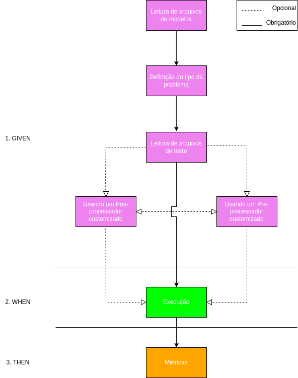

# BDD4ML : Um framework para avaliar modelos de machine learning 

## Breve Descrição
O projeto proposto se chama BDD4ML. Se trata de um framework de testes de modelos de machine learning usando cláusulas de Behaviour Driven Development (BDD). Utilizando o framework "Behave", o sistema associará funções de código a descrições em linguagem natural do comportamento do sistema. Essa associação sinaliza aos usuários finais como o sistema realmente se comporta, sem exigir conhecimento de programação. Essa feature torna essa ferramenta interessante para ser usada tanto por desenvolvedores de sistemas com componentes de machine learning como por quem realizará a especificação do sistema e ficaŕa em constante contato com usuários finais, os quais são pouco versados em programação de casos de testes.

## O que são as cláusulas BDD

As cláusulas BDD (Behavior Driven Development) são componentes fundamentais que ajudam a descrever o comportamento esperado de um sistema de forma clara e colaborativa, utilizando uma linguagem acessível tanto para desenvolvedores quanto para não desenvolvedores, como stakeholders. Elas são usadas para escrever cenários que descrevem como uma funcionalidade do sistema deve se comportar em diferentes situações. Existem três principais cláusulas:

1. `Given`:
   - Usada para descrever o contexto ou o estado inicial antes de uma ação ocorrer.
   - Exemplo: "Given o usuário está autenticado no sistema."

2. `When`:
   - Define a ação ou evento que será realizado.
   - Exemplo: "When o usuário clica no botão de login."

3. `Then`:
   - Descreve o resultado esperado após a ação.
   - Exemplo: "Then o sistema deve redirecionar para a página inicial."

### Cláusula `And`

- A cláusula `And` é usada para adicionar passos do mesmo tipo da linha anterior, que pode ser um contexto (`Given`), ação (`When`) ou resultado (`Then`).
- Exemplo: "Given o usuário está autenticado no sistema.
And o usuário é um admin."


## Como Executar o framework

Para criar testes usando o framework deve-se criar um arquivo `.feature` na pasta `features/`

``` 
project/
│
├── features/
    └── example.feature
```

Os arquivos '.feature' descrevem os cenários em uma linguagem próxima do inglês. Crie um arquivo `example.feature` dentro da pasta `features/` com o seguinte conteúdo:

```gherkin
Feature: <Título do teste>

  Scenario: <Título do scenario>
    Given <Exemplo de clausula do tipo 'Given'>
    And <Exemplo de clausula do tipo 'And', que repete o tipo acima, 'Given'>
    When <Exemplo de clausula do tipo 'When'>
    Then <Exemplo de clausula do tipo 'Then'>
```


## Fluxo de execução do framework

O usuário deverá escrever as cláusulas em um arquivo `.feature` na ordem sugerida no diagrama. Cada cláusula e seu uso será detalhado nas próximas seções.



## Como Rodar o framework

Após preencher o arquivo `.feature` execute o comando `behave` na linha de comando


<h2 style="color:violet;">1. Cláusulas BDD - Given</h2>  

<h3 style="color:violet;">1.1. Leitura de arquivos de modelos:</h3>  
O framework consegue ler arquivos de modelos para testes. Esses arquivos devem ser legíveis pela biblioteca "pickle", terminar com o sufixo "_model.pkl" e serem colocados na pasta "estimators". O framework é capaz de rodar em modelos de classificação e regressão. O modelo deve ser escrito com sufixo "_model.pkl" e, caso tenha um scaler associado, o scaler deverá ter o mesmo prefixo que o modelo porém o arquivo deverá ter um sufixo "_scaler.pkl". O scaler também estará presente na pasta "estimators".

Além disso, o usuário deverá oferecer um arquivo de configuração json do modelo na pasta "model_configs" especificando os nomes de cada coluna de dados utilizada pelo modelo. Os atributos são separados em features usadas para prever o valor e features a serem previstas (target). Esse arquivo de configuração deverá ter o mesmo nome que o arquivo do modelo mas terá a extensão ".json". O usuário deve fornecer a localização do arquivo do modelo como uma declaração BDD.

```json
{
    "feature_names" : [...],  // lista de nomes das features usadas na predição de novos valores
    "target_names" : [...],   // lista de nomes das features que o modelo realiza a predição
}
```

<b><span style="color:violet;">cláusula_BDD</span> </b>

```gherkin
Given We obtain a model from the file {model_prefix}
```


`<model_prefix>` - Deve dizer qual o nome do arquivo do modelo sem o sufixo "_model.pkl", este arquivo deve estar na pasta 'estimators', essa pasta se localiza na raiz do projeto. Esse nome também informa qual o scaler e o arquivo de configuração ".json", portanto todos devem ter o mesmo nome excluindo a extensão.

<h3 style="color:violet;">1.2. Definição do tipo de problema:</h2>  
Com o modelo carregado em memória pela clausula anterior. Devemos definir como vamos avaliar o problema. Ele pode ser avaliado tanto como um problema de classificação como de regressão e isso vai depender do tipo do modelo e do poś processamento aplicado.

__Pré-requisitos:__ 1.1.

<b><span style="color:violet;">cláusula_BDD</span> </b>

```gherkin
Given We evaluate the test as a {eval_type} problem
```

`<eval_type>` deve dizer qual o tipo do avaliação que será feita sobre os resultados. O framework somente suporta avaliar o problema como sendo de classificação ou regressão:

&nbsp;&nbsp;&nbsp;&nbsp;`classification` - indica que o problema é de classificação.

&nbsp;&nbsp;&nbsp;&nbsp;`regression` - indica que o problema é de regressão.


<h3 style="color:violet;">1.3. Leitura de arquivos de teste:</h2>  
O framework é capaz de ler arquivos que contêm todos os casos de teste a serem avaliados pelo modelo. Esses casos de teste devem ser compatíveis com o modelo fornecido para teste e devem estar no formato de um arquivo "Comma-separated values" (.csv). O usuário deve fornecer a localização do arquivo de teste como uma declaração BDD.

__Pré-requisitos:__ 1.1.; 1.2.

<b><span style="color:violet;">cláusula_BDD</span> </b>

```gherkin
Given We obtain test data from the file {filename}
```

`<filename>` deve dizer qual o nome do arquivo, com extensão ".csv", contendo os casos de teste, este arquivo deve estar na pasta 'test_data' na raiz do projeto, o arquivo deve ser escrito em .csv.

<h3 style="color:violet;">1.4. Usando um Pré-processador customizado:</h2>  
Caso seus dados precisem passar por um preprocessamento específico o usuário deverá utilizar essa cláusula, caso contrário não precisa utiliza-la. Caso opte por um preprocessador customizado, ele deverá também especificar o código do preprocessador a ser utilizado na pasta "my_modules" e importá-lo no arquivo "features/main.py"


<b><span style="color:violet;">Exemplo de uso do preprocessor na main.py</span> </b>

```python
from features.modules.my_modules.cii.cii_preprocessor import XGBoostPreProcessor

@given('We use a custom preprocessor to transform the data')
def use_custom_preprocessor(context):
    ...
    # insert your preprocessor here
    context.preprocessor = XGBoostPreProcessor(context.model_dataConfigLoader.get_feature_names(),context.model_dataConfigLoader.get_target_names(),'ship_type_name',context.model_scaler,'AFRAMAX')
```

__Pré-requisitos:__ 1.1.; 1.2.; 1.3

<b><span style="color:violet;">cláusula_BDD</span> </b>

```gherkin
Given We use a custom preprocessor to transform the data
```

<h3 style="color:violet;">1.5. Usando um Pós-processador customizado:</h2>  
Caso seus dados precisem passar por um pósprocessamento o usuário deverá utilizar essa cláusula, caso contrário não precisa utiliza-la. Caso opte por um pósprocessador customizado, ele deverá também especificar o código do pósprocessador a ser utilizado na pasta "my_modules" e importá-lo no arquivo "features/main.py"

__Exemplo de uso do postprocessor na main.py__

```python
from features.modules.post_processor import CarbonPostProcessor

@given('We use a custom postprocessor to transform the data')
def use_custom_postprocessor(context):
    ...
    # insert your preprocessor here
    context.postprocessor = CarbonPostProcessor(context.model_dataConfigLoader.get_feature_names(),context.model_dataConfigLoader.get_target_names(),'ship_type_name','AFRAMAX')
```

__Pré-requisitos:__ 1.1.; 1.2.; 1.3

<b><span style="color:violet;">cláusula_BDD</span> </b>

```gherkin
Given We use a custom postprocessor to transform the data
```

<h2 style="color:lime;">2. Cláusulas BDD - When</h2>  

<h3 style="color:lime;">2.1. Executando o teste do modelo:</h2>  
Após fornecer os arquivos do modelo, de configurações, de dados e definir o preprocessador, o framework executa os testes e produz uma estrutura de dados contendo os resultados. Esses resultados podem ser utilizados em funcionalidades posteriores para avaliação.


__Pré-requisitos:__ 1.1.; 1.2.; 1.3

<b><span style="color:lime;">cláusula_BDD</span> </b>

```gherkin
When We process the data
```

<h2 style="color:orange;">3. Cláusulas BDD - Then</h2>  

<h3 style="color:orange;">3.1. Métricas descritivas de desempenho do modelo:</h3>  
Após definir as clausulas referentes a definição do modelo, definição do arquivo de teste a ser utilizado e a execução dos testes, o usuário deve fornecer ao menos uma cláusula BDD que avalie os resultados desse teste. Essa cláusula compara o resultado de uma métrica do modelo a um limite esperado pelo usuário. Essas consultas demonstram os resultados das métricas do modelo de maneira auto-descritiva para o usuário final, evitando confusão. A métrica utilizada não deve ser declarada explicitamente, mas sim explicada no contexto do resultado. Essa abordagem pode ser aplicada para métricas de precisão, recall e acurácia, os quais serão detalhadas nos tópicos abaixo.


<h4 style="color:orange;">3.1.1. Métrica descritiva de recall geral:</h4>  

Em vez de afirmar "o modelo atingiu 70 por cento de recall," a consulta diz, "o modelo identifica corretamente positivos reais em 70 por cento dos casos."


<b><span style="color:orange;">cláusula_BDD</span> </b>

```gherkin
Then the model correctly classifies real positives of all classes [with a {average_type}]* {number} percent of the time

# * o trecho é opcional, se assume por padrão o valor 'macro average' para 'average_type'. ao inclui-lo não use os '[]'
```

`<number>` - valor numérico entre 0 e 100 que indica o percentual que a métrica de recall deve atingir.


`<average_type>` -  deve dizer qual o tipo de média a ser usada no calculo da métrica. As opções são as segunites:

&nbsp;&nbsp;&nbsp;&nbsp;`macro average` - não leva em consideração a proporção que cada resultado da classificação tem nos resultados dos testes.

&nbsp;&nbsp;&nbsp;&nbsp;`weighted average` - leva em consideração a proporção que cada resultados da classificação tem nos resultados dos testes.

<h4 style="color:orange;">3.1.2. Métrica descritiva de recall de uma classe específica:</h4>  

Em vez de afirmar "o modelo atingiu 70 porcento de recall na classe 'setosa'" a consulta deve dizer, "o modelo identifica corretamente positivos reais em 70 por cento dos casos da classe 'setosa'".

<b><span style="color:orange;">cláusula_BDD</span> </b>

```gherkin
Then the model correctly classifies real positives of class '{class}' {number} percent of the time.
```

`<number>` - valor numérico entre 0 e 100 que indica o percentual que a métrica de recall deve atingir.


`<class>` -  qual o resultado especifico de classificação que deseja medir o recall. Se o seu dataset tem como possíveis resultados de classificação 'setosa' ou 'virginica' alguma delas deverá ser o valor de 'class'. Caso seu dataset possua como outputs somente os valores '0' e '1', escreva os valores na clausula como 'False' ou 'True' respectivamente.


<h4 style="color:orange;">3.1.3. Métrica descritiva de precisão geral:</h4>  

Similar ao caso anterior, a precisão pode ser apresentada de forma descritiva. Em vez de afirmar "o modelo atingiu 80 por cento de precisão" a consulta deve dizer, "o modelo identifica corretamente positivos previstos em 80 por cento dos casos".

<b><span style="color:orange;">cláusula_BDD</span> </b>

```gherkin
Then the model correctly classifies predicted positives of all classes [with a {average_type}]* {number} percent of the time

# * o trecho é opcional, se assume por padrão o valor 'macro average' para 'average_type'. ao inclui-lo não use os '[]'
```

`<number>` - valor numérico entre 0 e 100 que indica o percentual que a métrica de precisão deve atingir.

`<average_type>` -  deve dizer qual o tipo de média a ser usada no calculo da métrica. As opções são a seguir:

&nbsp;&nbsp;&nbsp;&nbsp;`macro average` - não leva em consideração a proporção que cada resultado da classificação tem nos resultados dos testes.

&nbsp;&nbsp;&nbsp;&nbsp;`weighted average` - leva em consideração a proporção que cada resultados da classificação tem nos resultados dos testes.

<h4 style="color:orange;">3.1.4. Métrica descritiva de precisão de uma classe específica:</h4>  

Em vez de afirmar "o modelo atingiu 80 por cento de precisão na classe 'setosa'" a consulta deve dizer, "o modelo identifica corretamente positivos previstos em 80 por cento dos casos da classe 'setosa'".

<b><span style="color:orange;">cláusula_BDD</span> </b>

```gherkin
Then the model correctly classifies predicted positives of class '{class}' {number} percent of the time
```

`<number>` - valor numérico entre 0 e 100 que indica o percentual que a métrica de precisão deve atingir.


`<class>` -  qual o resultado especifico de classificação que deseja medir o recall. Se o seu dataset tem como possíveis resultados de classificação 'setosa' ou 'virginica' alguma delas deverá ser o valor de 'class'. Caso seu dataset possua como outputs somente os valores '0' e '1', escreva os valores na clausula como 'False' ou 'True' respectivamente.

<h4 style="color:orange;">3.1.5.Métrica descritiva de acurácia geral:</h4>  

Similar ao caso anterior, a precisão pode ser apresentada de forma descritiva. Em vez de afirmar "o modelo atingiu 80 por cento de acurácia em todas as classes," a consulta deve dizer, "o modelo atribui corretamente a classificação de todas as classes 80 por cento do tempo."

<b><span style="color:orange;">cláusula_BDD</span> </b>

```gherkin
Then the model correctly classifies all classes {number} percent of the time
```

`<number>` - valor numérico entre 0 e 100 que indica o percentual que a métrica de acurácia deve atingir.

<h3 style="color:orange;">3.2. Métricas explícitas de desempenho de modelos de classificação:</h3>
Com os resultados dos testes de funcionalidades anteriores, o usuário deve fornecer ao sistema uma consulta sobre os resultados desse teste. Essa consulta deve ser feita na forma de uma declaração BDD que compare o resultado de uma métrica do modelo a um limite esperado pelo usuário. Diferente das métricas mencionadas em funcionalidades anteriores, muitas métricas, como o f1-score, não podem ser diretamente traduzidas de forma concisa para o usuário final e, portanto, só podem ser inferidas diretamente pelo framework. Uma consulta como "o modelo atingiu 0,8 de f1-score" não explica o que é a métrica, mas permite que todas as métricas sejam exibidas, independentemente de sua complexidade. Esta é a forma padrão de mostrar a maioria das métricas de classificação e regressão e estará disponível para todas as métricas cobertas pelo framework.

<h4 style="color:orange;">3.2.1. Métrica explicita geral:</h4>

<b><span style="color:orange;">cláusula_BDD</span> </b>

```gherkin
Then the model will reach a value of {threshold} on the metric {metric} [on a {average_type}]*

# * o trecho é opcional, se assume por padrão o valor 'macro average' para 'average_type'. ao inclui-lo não use os '[]'
```

`<threshold>` - valor numérico que indica o valor que a métrica deve atingir, para cada métrica abaixo está descrito o valor aceitado para ela.

`<metric>` - métrica deseja que o usuário deseja medir.

&nbsp;&nbsp;&nbsp;&nbsp;`recall` - aceita valores entre 0 e 100 (percentuais).

&nbsp;&nbsp;&nbsp;&nbsp;`precision` - aceita valores entre 0 e 100 (percentuais).

&nbsp;&nbsp;&nbsp;&nbsp;`accuracy` - aceita valores entre 0 e 100 (percentuais).

&nbsp;&nbsp;&nbsp;&nbsp;`f1_score` - aceita valores entre 0 e 100 (percentuais).

`<average_type>` -  deve dizer qual o tipo de média a ser usada no calculo da métrica. Essa opção não funciona para a métrica 'accuracy'. As opções são a seguir:

&nbsp;&nbsp;&nbsp;&nbsp;`macro average` - não leva em consideração a proporção que cada resultado da classificação tem nos resultados dos testes.

&nbsp;&nbsp;&nbsp;&nbsp;`weighted average` - leva em consideração a proporção que cada resultados da classificação tem nos resultados dos testes.

<h4 style="color:orange;">3.2.2. Métrica explicita de uma classe específica:</h4>

<b><span style="color:orange;">cláusula_BDD</span> </b>


```gherkin
Then the model will reach a value of {threshold} on the metric {metric} on class '{class}'
```

`<threshold>` - valor numérico que indica o valor que a métrica deve atingir.

`<metric>` - métrica que o usuário deseja medir.

&nbsp;&nbsp;&nbsp;&nbsp;`recall` - aceita valores entre 0 e 100 (percentuais).

&nbsp;&nbsp;&nbsp;&nbsp;`precision` - aceita valores entre 0 e 100 (percentuais).

&nbsp;&nbsp;&nbsp;&nbsp;`accuracy` - aceita valores entre 0 e 100 (percentuais).

&nbsp;&nbsp;&nbsp;&nbsp;`f1_score` - aceita valores entre 0 e 100 (percentuais).

`<class>` -  qual o resultado especifico de classificação que deseja medir o recall. Se o seu dataset tem como possíveis resultados de classificação 'setosa' ou 'virginica' alguma delas deverá ser o valor de 'class'. Caso seu dataset possua como outputs somente os valores '0' e '1', escreva os valores na clausula como 'False' ou 'True' respectivamente.


<h3 style="color:orange;">3.3. Métricas explícitas de desempenho de modelos de regressão:</h4>

A mesma ideia que a definição acima mas para modelos de regressão.

<b><span style="color:orange;">cláusula_BDD</span> </b>

```gherkin
Then the model will reach {metric} {reference} {number}
```

`<number>` - valor numérico que indica o valor que a métrica deve atingir.

`<reference>` - palavra que sinaliza qual a orientação que a métrica deve ser avaliada

&nbsp;&nbsp;&nbsp;&nbsp;`above` - Sinaliza que a métrica deve atingir um valor acima do valor estabelecido. válido somente para a metrica `R2 Score`

&nbsp;&nbsp;&nbsp;&nbsp;`below` - Sinaliza que a métrica deve atingir um valor abaixo do valor estabelecido. válido para as demais métricas.


`<metric>` - métrica que o usuário deseja medir.

&nbsp;&nbsp;&nbsp;&nbsp;`an R2 Score`

&nbsp;&nbsp;&nbsp;&nbsp;`a Mean Squared Error`

&nbsp;&nbsp;&nbsp;&nbsp;`a Mean Absolute Error`

&nbsp;&nbsp;&nbsp;&nbsp;`a Root Mean Squared Error`

&nbsp;&nbsp;&nbsp;&nbsp;`a Median Absolute Error`