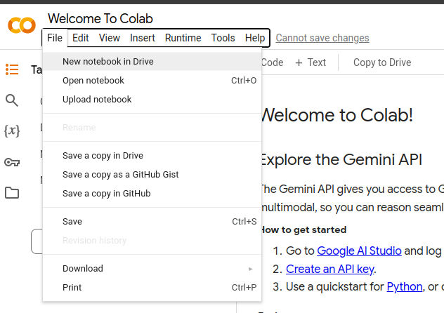

# BDD4ML execução dos testes em aula


## 1 Abra um notebook no google colab

### Abra o google colab: https://colab.research.google.com/

### Na foto abaixo clique em 'New Notebook In Drive' e faça o login no google se necessário





### Com um novo notebook no colab, copie os comandos abaixo para uma celula e execute-os:

```
!git clone https://github.com/Esduard/INF2102_BDD4ML.git
%cd INF2102_BDD4ML
!pip install -r requirements.txt
```

## 2 Preencha O formulário de caracterização 

Formulário de caracterização: https://forms.gle/PPpoMjyequmCPNkK8

## 3 Explicando O framework

Acompanhe os slides no diretório 'slides/Explicando_BDD4ML.pdf

## 4 Atividade 'carbono - regressão'

Realize A Atividade 'instruções do carbono  - regressão' na pasta 'documents'

## 4 Atividade 'carbono - classificação'

Realize A Atividade 'instruções do carbono  - classificação' na pasta 'documents'

## 5 Questionário final

Ao fim da atividade preencha o formulário: https://forms.gle/7bpTtPMGMChWktFx6

## 6 Finalização

FInalize enviando os arquivos gerados para o email: eduardomotta1701@gmail.com


# Instruções De Instalação Local

```
Passo 1: Instale o python 3.11 em seu computador (https://www.python.org/downloads/release/python-3119/). A forma de instalação irá depender do seu sistema operacional.

Passo 2: Instale os pacotes de bibliotecas necessárias, os pacotes estão no arquivo 'requirements.txt', na raiz do projeto.
```